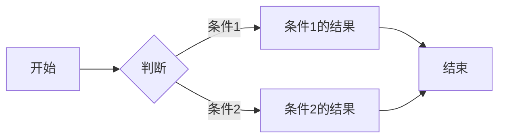
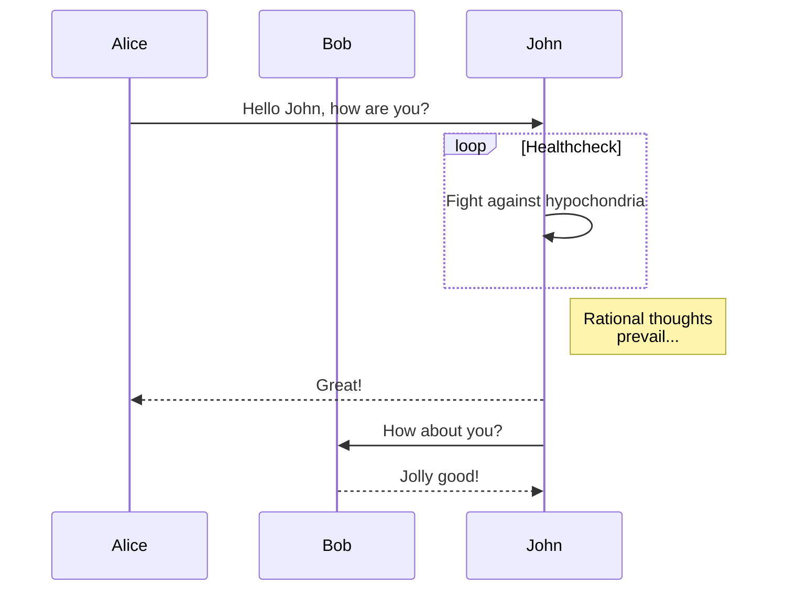
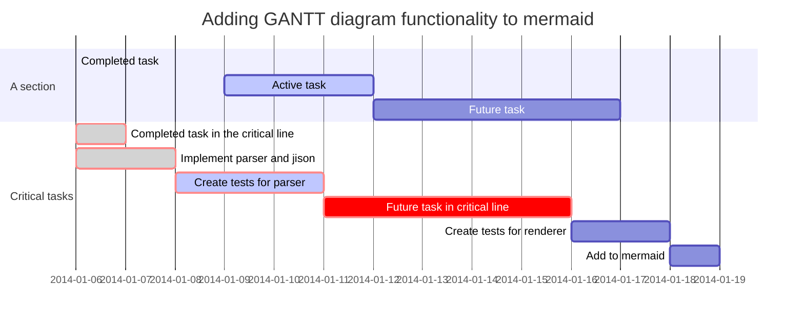
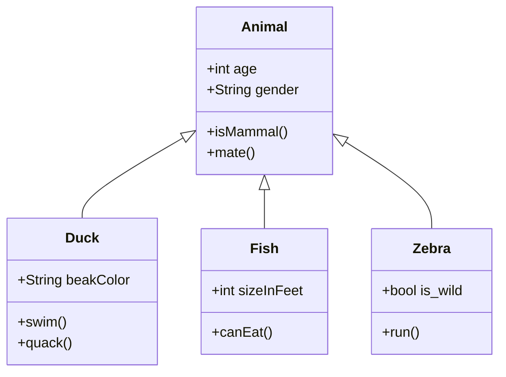

这是文章的头部内容

------------------------------------------------------------------------

以下是正文

# 一级标题

## 二级标题

内容描述

公式渲染:

$$\begin{aligned}
  p(t) & = a_0 + a_1 t + a_2 t^2 + \dots + a_Nt^N \\
  & = \sum_{n=0} ^{N} a_n t^n\end{aligned}$$

## 支持的 Markdown 语法

### 标题

# 一级标题

## 二级标题

### 三级标题

#### 四级标题

##### 五级标题

###### 六级标题

### 段落

这是第一段。

这是第二段。

### 强调

**加粗**

*斜体*

~~删除线~~

### 列表

#### 无序列表

- 项目一
- 项目二
- 项目三

#### 有序列表

1. 项目一
2. 项目二
3. 项目三

### 链接

[链接文本](https://example.com)

### 图片


### 表格

| 表头1 | 表头2 | 表头3 | 表头4 |
| ----- | ----- | ----- | ----- |
| 单元格1 | 单元格2 | 单元格3 | 单元格4 |
| 单元格5 | 单元格6 | 单元格7 | 单元格8 |

### 代码

#### 行内代码

`代码`

#### 代码块

```python
def hello_world():
    print("Hello, world!")
```

### 引用

> 这是一个引用。

### 分割线

---

### 脚注

这是一个脚注[^1]。

[^1]: 这是一个脚注。

### 数学公式

#### 行内公式

这是一个行内公式：$E = mc^2$。

#### 独立公式

这是一个独立公式：

$$
E = mc^2
$$

### HTML

这是一个 HTML 元素：`<div>这是一个 HTML 元素</div>`。

### Mermaid 流程图



### Mermaid 序列图



### Mermaid 甘特图



### Mermaid 类图



------------------------------------------------------------------------

这是文章的结尾

完
